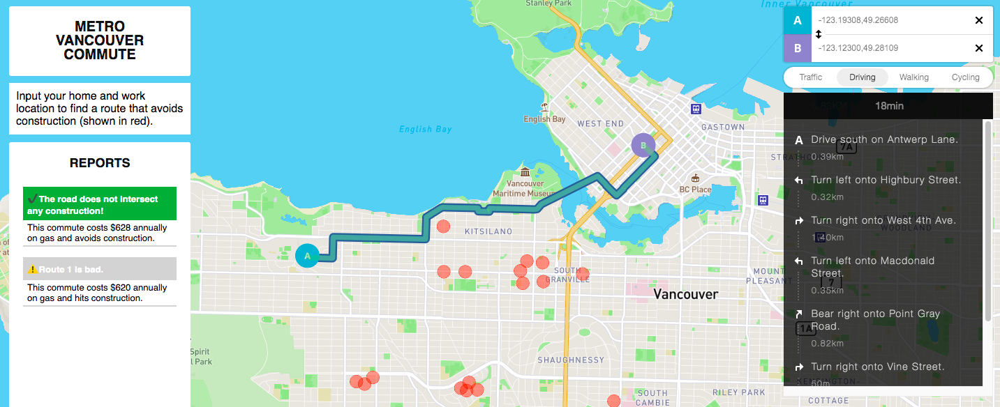

# Vancouver Commute

My interactive map allows the user to input a starting location (home) and an end location (work) to figure out the best route to work. As gas prices in Vancouver are skyrocketting, I wanted the user to be able to fully understand their annual gas costs (based on a price of $1.8/L).

The map can be accessed here: https://erickv112.github.io/vancouver-commute/

     

<h4>Designing the Map</h4>
As many workers are returning back to the office, I wanted to create a map that showcases commuting in some sort of way. In doing so, the biggest idea that came to mind when commuting to work was how to avoid traffic. Since traffic is heavily correlated with construction, I looked at [Vancouver Road Closures](https://vancouver.ca/streets-transportation/roadwork.aspx) to indicate where road closures were in Vancouver. Moreover, As per my feedback from the previous lab where I failed to include thematic mapping, I focused a little more on the actual terrain of the map by highlighting neighbourhood areas, schools, parks, landmarks, and food locations at the top of the visual hierarchy so that the map is not limited to just home-->work but for other notable navigational uses. For this map, I didn't actually source any data (other than construction locations), but mostly allow the user to load their own routes then then map can provide insight in another way. The principal was to deliver real-world cases for the user to understand the world.

<h4>APIs</h4>
The main APIs I used were Mapbox and Turf. Mabox allowed me to specify the basemap details that catered towards navigational uses. They have a navigation API that allows the user to input the start and endpoints and convert it into latitude and longitude coordinates. The second main API was turf.js. Turf allowed me to specify buffer zones for each construction site and transform the route polyline to find a different route. The function ‘transformScale’ is the main function to figuring out the best route that does not intersect with construction.

<h4>Original Map and Hopeful Improvements</h4>
My <a href="https://github.com/erickv112/vancouver-commute/blob/main/originalmap.png">links text</a> was actually sourced through the Google Maps API using React.js and node.js. It was essentially the exact same map but included real-time traffic and construction data, real-time data from Translink, and showcased more statistics on the route. However, my issue was that although the application was up and running on my local server, there were too many bugs to upload it onto GitHub and other options required payment. (Essentially, I bit off more than I could chew.) Though as a map that was created within a day, I’m quite proud of it! I also left some commented code which I failed to input within the time limit including a popup for details on the construction data, and more info on the stats of the route. 
